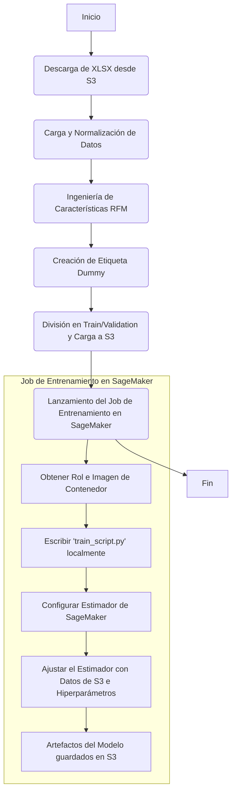

# Pipeline de Entrenamiento XGBoost en SageMaker

Este documento describe el script `train_pipeline.py`, un pipeline completo para entrenar un modelo XGBoost en SageMaker utilizando el dataset "Online Retail". El script es una aplicación de Python standalone y no tiene dependencias de Jupyter.

## Tabla de Contenidos
1.  [Descripción General](#descripción-general)
2.  [Configuración](#configuración)
3.  [Diagrama de Flujo del Pipeline](#diagrama-de-flujo-del-pipeline)
4.  [Pasos del Pipeline](#pasos-del-pipeline)
    *   [1. Descarga de Datos](#1-descarga-de-datos)
    *   [2. Carga y Normalización](#2-carga-y-normalización)
    *   [3. Ingeniería de Características (Feature Engineering)](#3-ingeniería-de-características-feature-engineering)
    *   [4. Creación de la Etiqueta (Label)](#4-creación-de-la-etiqueta-label)
    *   [5. División y Carga a S3](#5-división-y-carga-a-s3)
    *   [6. Script de Entrenamiento de SageMaker](#6-script-de-entrenamiento-de-sagemaker)
    *   [7. Lanzamiento del Job de Entrenamiento](#7-lanzamiento-del-job-de-entrenamiento)

## Descripción General

El script `train_pipeline.py` automatiza los siguientes pasos de forma secuencial:

1.  **Descarga de Datos**: Descarga un archivo Excel con transacciones desde un bucket de AWS S3.
2.  **Carga y Normalización**: Carga los datos del archivo Excel y realiza una limpieza y normalización básica.
3.  **Ingeniería de Características**: Crea características de cliente basadas en RFM (Recency, Frequency, Monetary).
4.  **Creación de Etiqueta**: Genera una etiqueta de ejemplo (dummy label) para el entrenamiento.
5.  **División y Carga a S3**: Divide los datos en conjuntos de entrenamiento y validación, y los sube a S3.
6.  **Entrenamiento del Modelo**: Lanza un job de entrenamiento de XGBoost en AWS SageMaker.

## Configuración

La configuración del pipeline se define directamente en el script:

| Parámetro           | Descripción                                           | Valor por Defecto                |
| :------------------ | :---------------------------------------------------- | :------------------------------- |
| `REGION`            | Región de AWS.                                        | `us-east-1`                      |
| `S3_BUCKET`         | Bucket de S3 para datos y artefactos.                 | `tdr-artifacts`                  |
| `S3_KEY`            | Key del archivo XLSX en S3.                           | `tmp_files/charlaPUC/onlineRetail.xlsx` |
| `LOCAL_DATA_DIR`    | Directorio local para almacenar datos temporalmente.  | `./data`                         |
| `INSTANCE_TYPE`     | Tipo de instancia de SageMaker para el entrenamiento. | `ml.m5.large`                    |
| `INSTANCE_COUNT`    | Número de instancias de SageMaker.                    | `1`                              |
| `XGBOOST_VERSION`   | Versión del framework XGBoost para SageMaker.         | `1.7-1`                          |

Los hiperparámetros de XGBoost se establecen mediante el método `set_hyperparameters` en el estimador.

## Diagrama de Flujo del Pipeline



## Pasos del Pipeline

### 1. Descarga de Datos

El script comienza inicializando un cliente de `boto3` y descargando el archivo `onlineRetail.xlsx` desde `S3_BUCKET` y `S3_KEY` a una carpeta local `./data`.

### 2. Carga y Normalización

La función `load_transactions_from_xlsx` se encarga de:
*   Leer el archivo Excel en un DataFrame de Pandas.
*   Normalizar los nombres de las columnas.
*   Convertir las columnas `InvoiceDate`, `UnitPrice` y `Quantity` a los tipos de datos correctos, manejando errores de coerción.
*   Renombrar las columnas a un formato estándar (`customer_id`, `product_id`, `date`, `price`, `quantity`).

### 3. Ingeniería de Características (Feature Engineering)

La función `build_features` toma el DataFrame de transacciones y:
*   Calcula el `revenue` por transacción.
*   Establece una `cutoff_date` (30 días antes de la última fecha) para separar los datos para la ingeniería de características.
*   Agrupa por `customer_id` para calcular métricas de RFM y otras características:
    *   `recency`: Días desde la última compra.
    *   `frequency`: Frecuencia de compra.
    *   `monetary`: Gasto total.
    *   `unique_products`: Número de productos únicos comprados.
    *   `total_quantity`: Cantidad total de artículos comprados.
*   Devuelve un DataFrame con un cliente por fila y sus características asociadas.

### 4. Creación de la Etiqueta (Label)

Se crea una columna `label` para el entrenamiento. En este script, es una **etiqueta de ejemplo (dummy)** donde los clientes con una `recency` menor a 30 días se marcan con `1` (activos) y el resto con `0`.

```python
df_features["label"] = (df_features["recency"] < 30).astype(int)
```

### 5. División y Carga a S3

El script realiza las siguientes acciones:
*   Divide el DataFrame de características en conjuntos de entrenamiento (80%) y validación (20%) usando `sample()`.
*   Guarda estos conjuntos como `train.csv` y `validation.csv` localmente.
*   Usa una `sagemaker.Session` para subir estos archivos CSV al bucket de S3, bajo el prefijo `online-retail-xgb/`.

### 6. Script de Entrenamiento de SageMaker

El contenido del script de entrenamiento (`TRAIN_SCRIPT_CONTENT`) se escribe en un archivo local llamado `train_script.py`. Este script es el `entry_point` para el job de SageMaker y se encarga de:
*   Leer los datos de entrenamiento y validación desde `/opt/ml/input/data/`.
*   Preparar los `DMatrix` de XGBoost.
*   Entrenar el modelo con los hiperparámetros proporcionados.
*   Guardar el modelo entrenado en `/opt/ml/model/`, desde donde SageMaker lo subirá a S3.

### 7. Lanzamiento del Job de Entrenamiento

Finalmente, el script:
*   Obtiene el rol de ejecución de SageMaker (`get_execution_role`).
*   Recupera la URI del contenedor de XGBoost (`1.7-1`).
*   Configura un `Estimator` de SageMaker, especificando el tipo de instancia, el rol y la ruta de salida.
*   Establece los hiperparámetros (`objective`, `num_round`, `eta`, `max_depth`) usando `set_hyperparameters`.
*   Lanza el job de entrenamiento con `estimator.fit()`, pasando las rutas de S3 para los datos de entrenamiento y validación.